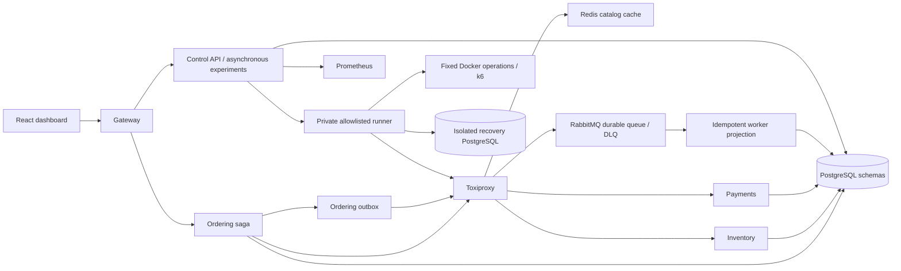

# Architecture

Six Go executables use standard-library HTTP, pgx, amqp091-go, go-redis, the OpenTelemetry trace SDK and Prometheus client. Shared packages contain configuration helpers, contracts, instrumentation and resilience, not service business logic. The ordering service coordinates HTTP calls; inventory and payment services exclusively update their owned schemas. Worker delivery state lives in its own schema. Each runtime role lacks write privileges to other schemas. Control uses its own tables and queries services/Prometheus; consistency verification is a privileged read-only runner operation.

One PostgreSQL instance simplifies local operations. Application PostgreSQL connections cross Toxiproxy; control connects directly so a PostgreSQL dependency-network interruption remains observable. The database itself stays running during that scenario. All inventory/payment application HTTP, Redis and AMQP connections traverse proxies.

The Docker runner is deliberately a separate private service. Its HTTP API accepts fixed operations; it resolves container identities by exact Compose project and service labels, and exposes no shell, hostname, path, image or Docker target input. It has powerful engine access internally, so compromise of this runner remains privileged. The UI, gateway and control never mount the socket. Do not make its network or API public.

The runtime stores operational state rather than reconstructing successes from frontend values. Experiment records include specification, transitions, windows, query evidence, errors and verification. Metrics are fetched from Prometheus, with unavailable values preserved. No infrastructure-as-code layer is included because there is no external deployment target requiring one.
